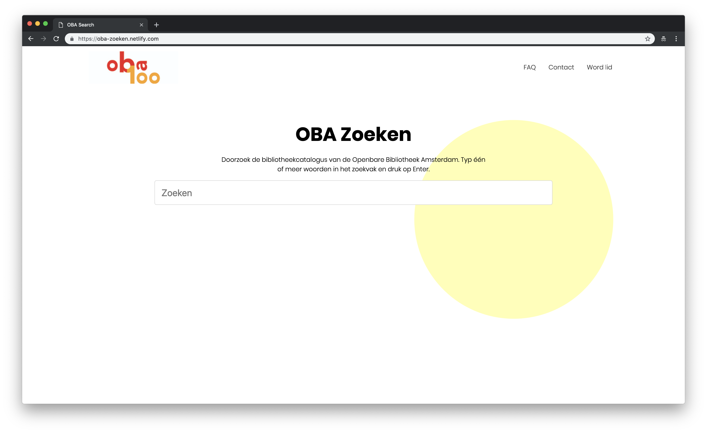

# OBA-Search

In this repository I try to improve the search functionality of the Public Library of Amsterdam. Currently the problem with the search function is that filters are hidden and filtering creates new calls to the server. And I think this could be improved.

## Table of Contents

1. [Live demo](#live-demo)
2. [Installation](#installation)
3. [Description](#description)
4. [Highlighted code](#Highlighted-code)
5. [What do I want to add to the project](#What-do-I-want-to-add-to-the-project)
6. [Technologies used](#technologies-used)
7. [Data sources](#data-sources)
8. [License](#license)

## Live demo

The live demo can be found at: [https://oba-zoeken.netlify.com/](https://oba-zoeken.netlify.com/)

|          Landings page          |        Search result page        |
| :-----------------------------: | :------------------------------: |
|  |  |

## Installation

Clone the repository through:

```bash
git clone https://github.com/timruiterkamp/project-1-1819
```

Install the dependencies

```bash
  yarn or npm install
```

Run the project

```bash
  yarn start or npm run start
```

## Description

The app is a search functionality for the Public Library of Amsterdam, where books can be found on keyword and filtered on format, title, author and year.

## Features

- Landing page with search functionality
- Single page application
- Data stored in a store
- Data filtering through the store for instant filter results.

## Highlighted code

The solution for the filtering of the search results, may be the key selling point of the application. In the current live version of the search engine, a new call gets fired to filter the books. This is not quite necessary as data could be stored after the call is completed and then get filtered. To prove the concept I did exactly this, stored the data after it was fetched and then filtered the stored data to save calls to the server.

The store works as following:

The state is defined as first.

```javascript
searchData: {},
```

the mutations are defined after the state is set:
The state is the defined state and the payload the data that needs to be added to the state.

```javascript
setSearchData(state, payload) {
    state.searchData = payload;
    return state;
  },
```

My actions would be declared like this:
The context is the mutations that has to be called and the payload is the data that needs to be handled

```javascript
setSearchData(context, payload) {
  context.commit("setSearchData", payload);
},
```

The way I use this in my project is as following:

```javascript
// to store data in the state
Store.dispatch("setSearchData", searchData);

//to gather the stored data
Store.state.searchData;
```

To filter the code I used the following actions:

```javascript
// The filter function is added as a listener to a input field
const filterTitle = e => {
  // The delay function makes sure to only filter when the user finished typing
  delay(() => {
    const create = new Generate();
    const body = document.querySelector(".search-results");
    // Access the data from the store, this way no calls have to be made.
    const titleFiltering = Store.state.searchData.map(data =>
      // Return the items where the objects title includes the search query value
      data.filter(item => {
        if (item.title && item.title.full) {
          return item.title.full
            .toLowerCase()
            .includes(e.target.value.toLowerCase());
        }
      })
    );
    // Create the results
    create.searchDetailResults(body, titleFiltering);
  }, 400);
};
```

## What do I want to add to the project?

- [x] Autocomplete functionality
- [x] Some animations and interactions
- [x] Error state when no results
- [x] Loading states
- [x] Store
- [x] Minimize calls

## Techniques used

- ParcelJS
- Fetch
- OBAWrapper from MaanLamp
- ES6+

## License

This repository is licensed as [MIT](LICENSE) by [Tim Ruiterkamp](https://github.com/timruiterkamp).
